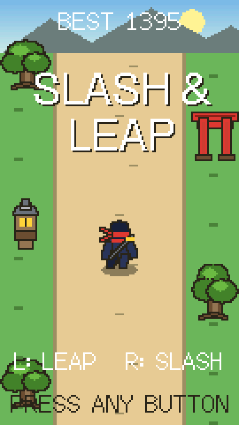
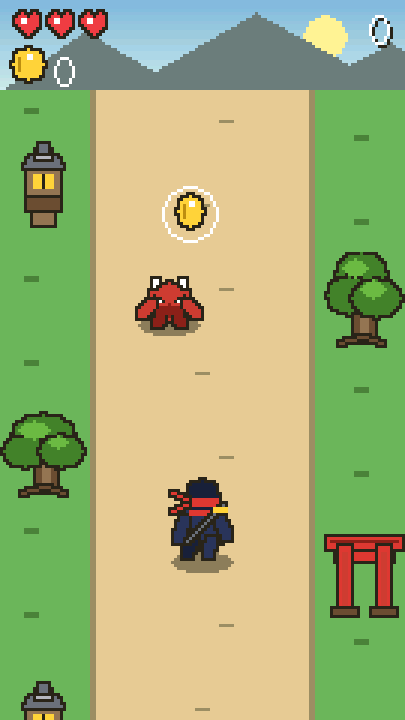
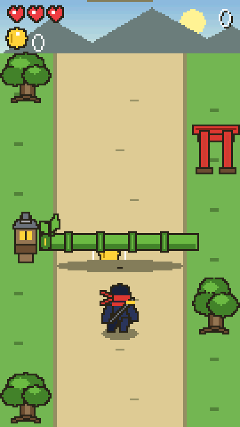
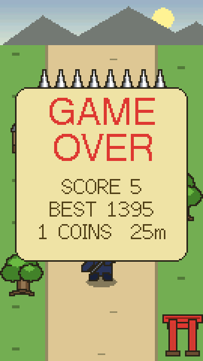
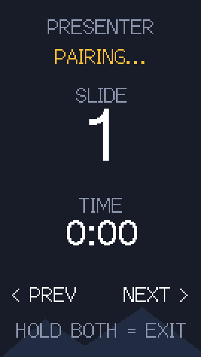

# Slash & Leap 🥷

A vertical ninja runner for the **LilyGO TTGO T-Display** (ESP32, 1.14" ST7789, 135×240), played in portrait. The ninja sprints up a mountain path while obstacles pour down toward you — **slash** what can be cut, **leap** what can't. No extra hardware; the two onboard buttons are the controls.

<p align="center">
  
  
  
  
</p>

<p align="center"><em>Pixel-perfect frames captured from the running board via the built-in serial screenshot command.</em></p>

## How it plays

Hold the board portrait, USB at the bottom — the buttons fall under your thumbs.

| Input | Action |
|---|---|
| **Left** button | Leap (hop with a drop-shadow; clears ground obstacles passing beneath you) |
| **Right** button | Slash (blade arc ahead of you) |
| Hold **right** ~1.5 s on title | Enter **Presenter mode** (BLE slide clicker) |
| Hold both ~1.5 s on title | Reset the best score |

Strict pairing — every obstacle has exactly one correct answer:

| Obstacle | Correct move |
|---|---|
| Bamboo stalk across the path | Slash |
| Charging demon | Slash |
| Spike strip | Leap |
| Rolling rock | Leap |

- **3 hearts**, brief invincibility after a hit; speed ramps up gently forever.
- **Combo multiplier** (up to ×8) grows with consecutive correct clears; one hit resets it.
- **Coins**: ground coins are grabbed while grounded, ringed **air coins only mid-leap**. Every 10th coin restores a lost heart (or +50 score at full health).
- **Day-night cycle**: the palette rolls through day, dusk, starry night, and dawn as you run.
- Best score survives power-off (NVS flash).

## Presenter mode 🎤



The board doubles as a wireless presentation clicker. Hold the **right** button ~1.5 s on the title screen and it starts advertising as a Bluetooth keyboard named **"Slash & Leap Remote"** — pair it from your computer's Bluetooth settings (first time only; it reconnects automatically after that).

- **Left** button sends ← (previous slide), **right** sends → (next slide) — works in Keynote, PowerPoint, and Google Slides.
- The screen shows connection status, a **slide counter**, and a **talk timer** that starts on your first "next".
- Hold **both** buttons ~1.5 s to exit back to the game (the device restarts; Bluetooth stays off in game mode).
- Runs fine from a power bank or a LiPo on the battery connector — no USB tether needed while presenting.

<br clear="all">

## Build & flash

Requires [PlatformIO](https://platformio.org/) (`pip install platformio`). Plug the board in and run:

```bash
pio run -t upload
```

The TFT_eSPI display configuration is injected via `build_flags` in [platformio.ini](platformio.ini) — no `User_Setup.h` to edit. The serial port is auto-detected.

Notes:

- Upload speed is 460800; some CH9102F USB chips drop packets at 921600.
- Config assumes the 16 MB flash version; for 4 MB remove the `board_upload.flash_size` and `board_build.partitions` lines.
- If jump/slash feel swapped in your hands, exchange `PIN_JUMP` and `PIN_SLASH` at the top of [src/main.cpp](src/main.cpp). If the screen is upside down, change `setRotation(0)` to `2`.

## Serial console tricks

Connect at 115200 baud and send:

- `S` — dumps the current frame as raw RGB565 (`SNAP\n` + 64800 bytes). The README screenshots were captured this way.
- `J` / `K` — remote leap / slash, so the game can be driven (or demoed) over USB.
- `P` — toggle Presenter mode (enters it, or restarts back to the game).

## Tuning

The feel lives in constants near the top of [src/main.cpp](src/main.cpp): jump arc in `jumpZ()`, slash reach in the `NINJA_Y - 46` window, the speed ramp in `ST_PLAYING`, spawn pacing in `spawnTimer`, and the obstacle mix in `spawnObstacle()`.

## Sibling project

The same board also runs [ttgo-flappy-bird](https://github.com/natluenthaisong/ttgo-flappy-bird) — flash whichever game you're in the mood for.

## License

[MIT](LICENSE)
